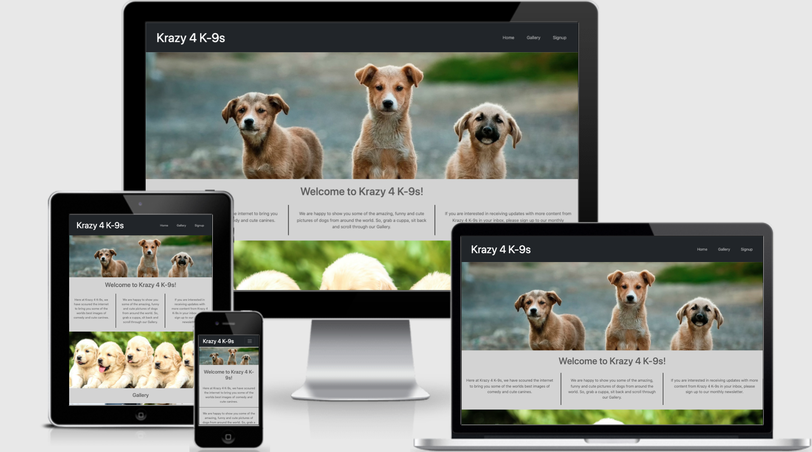

# Krazy 4 K-9s
This is a simple project with the hope to provide people some much needed stress relief after a hectic day. This is aimed at everyone who wants to enjoy our cute furry friends. This will hopefully be helpful in creating a few minutes of relief from daily life.

This project is for educational purposes and can not be used as a template for business use. The main aim is to build a responsive website using HTML and CSS as part of the User-Centric Frontend Development Milestone Project for Code Institute. I will also use the Bootstrap framework to keep the website consistent and clear.

[Link to Desktop Wireframes](wireframes/DesktopView.png)

[Link to Mobile Wireframes](wireframes/MobileView.png)

[Link to Live Project in GitHub Pages](https://kimb81.github.io/CI-MS1-Project/)

[Link to Am I Responsive? Website](http://ami.responsivedesign.is/?url=https%3A%2F%2Fkimb81.github.io%2FCI-MS1-Project%2F#)

---
## Table of Contents
- [UX](#ux)
    - [Goals](#goals)
    - [User Stories](#user-stories)
- [Features](#features)
    - [Existing](#existing)
    - [To Implement](#to-implement)
- [Styling](#styling)
    - [Structure](#structure)
    - [Typography](#typography)
    - [Colours](#colors)
- [Technology](#technology)
- [Testing](#testing)
    - [Validation](#validation-testing)
    - [Functionality](#functionality)
    - [Compatability](#compatability)
    - [Performance](#performance)
    - [Bugs](#bugs)
- [Deployment](#deployment)
- [Credit](#credit)
    - [Code](#code)
    - [Media](#media)
- [Thank You](#thank-you)

---

### __UX__
- __Goals__
    - ___Website Owner___
        - As the website owner, I would like a website that is designed with the intention of providing some stress relief to people that wish to relax after a hectic day or for someone who enjoys looking at images of cute dogs. 
        - As the website owner, I want to be able to allow users to signup, or update their email address, to receive a weekly or monthly newsletter containing a sample of the new content from the past month.
        - As the website owner, I want to be able to have an easy to navigate website that provides a good user experience.
    - ___Website User___
        - _New Website User_
            - As a new website user, I would like to be able to peruse images and videos of cute and funny dogs.
            - As a new website user, I would like to signup to a newsletter that keeps me updated with new content.
        - _Returning Website User_
            - As a returning website user, I would like to peruse the latest content.
            - As a returning website user, I would like to update the email address I provided for the newsletter.
- __User Stories__
    - ___Owner___
        - As the website owner, I would like to collate and showcase some of the best dog pictures and videos from around the internet in one place to provide people with some much needed stress relief.
        - As the website owner, I would like to provide a place where my users can provide, or update, their email address to receive a monthly newsletter containing the latest content.
        - As a website owner, I would like to provide my clients with a clean and easy to navigate website.
    - ___User___
        - _New User_
            - As a new user, I would like to peruse some images and videos that contain cute dogs.
            - As a new user, I would like to be able to signup to a monthly newsletter.
            - As a new user, I would like to be able to navigate around the website easily.
        - _Returning User_
            - As a returning user, I would like to peruse the latest content of cute and funny dogs.
            - As a returning user, I would like to be able to update the email address associated with the newsletter mailing list.
            - As a returning user, I would like to navigate around the website as easily as I did the first time.

[Back to Table of Contents](#table-of-contents)

---
### __Features__
- ___Existing Features___
    - _Navigation Bar_
        - This will contain the website logo to the left.
        - This will be used for ease of navigation through the site with links to Home, Gallery and Sign Up to the right.
        - This will remain fixed at the top while scrolling.
        - This will be responsive, adjusting to the device being used.
    - _Gallery_
        - This will showcase some of the best images and videos of dogs found from searching the internet.
    - _Sign Up_
        - This will allow the ability to signup to a monthly newsletter that provides an update of the newest website content.
- ___Features to Implement___
    - _Search Bar_
        - This will allow users to search for images or videos that cover a specific search term.
    - _Links Area_
        - This will provide links to websites that have too many images to be copied to the gallery.
    - _Feature my own furry friend_
        - This will allow users the ability to submit images of their own pets for others to peruse.
    - _Admin Area_
        - This will allow the Owner to upload the images and videos quicker and easier.

[Back to Table of Contents](#table-of-contents)

---
### __Styling__
- ___Structure___
    - The website is designed to be easy and user-friendy whether viewed on a desktop, a tablet or a mobile device. There should be minimal difference for a user providing a fantastic experience.
    - The website will be a 3 page scrollable site with the Navigation Bar remaining fixed at the top so the links are easy to access.
    - The website will contain areas for navigation, a gallery and a place to signup to a newsletter.
- ___Typography___
    - _Main Font_: A specific one was not chosen for this project.
- ___Colours___
    - _Website Background_: Light Grey
    - _Website Font_: rgba(60, 60, 60, 0.8)
    - _Form Background_: rgba(60, 60, 60, 0.6)
    - _Form Font_: #fafafa
    - _Link Background_: #fafafa
    - _Link Font_: rgba(60, 60, 60, 0.6)

[Back to Table of Contents](#table-of-contents)

---
### __Technology__
- ___[Balsamiq](https://balsamiq.com/)___: A useful tool for generating wireframes.
- ___[Bootstrap](https://getbootstrap.com/)___: A framework to assist in making the website responsive on any device.
- ___[HTML](https://en.wikipedia.org/wiki/HTML)___: A language used for the structure of the website.
- ___[CSS](https://en.wikipedia.org/wiki/CSS)___: A language used for the styling of the website.
- ___[Git](https://git-scm.com/)___: A useful tool to track versions of the website.
- ___[GitHub](https://github.com/)___: A useful tool to host the project in a remote location.
- ___[GitPod](https://www.gitpod.io/)___: A useful tool for creating and editing the code for the website.

[Back to Table of Contents](#table-of-contents)

---
### __Testing__
- ___Validation Testing___
    - _[HTML Validation Link](https://validator.w3.org/nu/?doc=https%3A%2F%2Fkimb81.github.io%2FCI-MS1-Project%2F)_ Validated [here](https://validator.w3.org/)
    - _[CSS Validation Link](http://jigsaw.w3.org/css-validator/validator?uri=https%3A%2F%2Fkimb81.github.io%2FCI-MS1-Project%2F&profile=css3svg&usermedium=all&warning=1&vextwarning=&lang=en)_ Validated [here](http://jigsaw.w3.org/css-validator/)
- ___Functionality___
    - My functionality testing was done using differnet browsers and their Developer tools throughout the project to test and resolve any issues with responsiveness or styling.
- ___Compatibility___
    - I tested the functionality over the following different browsers and devices:
        - MacBook Air:
            - Google Chrome
            - Safari
            - FireFox
        - iPhone 7s
            - Google Chrome
            - Safari
            - FireFox
- ___Performance___
    - I utilised [Googles Lighthouse](https://developers.google.com/web/tools/lighthouse) feature to check on my websites performance throughout the project and adjusted things as necessary. The following is the end results:
        - [LightHouse Results Mobile](lighthouse/lighthouseresultsmobile.pdf)
        - [LightHouse Results Desktop](lighthouse/lighthouseresultsdesktop.pdf)
- ___Bugs___
    - I did not encounter any bugs while creating this website.

[Back to Table of Contents](#table-of-contents)

---
### __Deployment__
To deploy my project to GitHub Pages, I took the following steps:
1. Login to [GitHub](https://github.com).
2. Navigate to the relevant repository.
3. Click Settings.
4. Scroll down and Click Pages on the left hand menu.
5. Under the option for Source, select the Master Branch.
6. Click Save.
7. The page should auto refresh and show a confirmation message and link.
8. Add the link to the About section for the repository.

[Back to Table of Contents](#table-of-contents)

---
### __Credit__
- To create this project I used the [GitHub Full Template](https://github.com/Code-Institute-Org/gitpod-full-template) provided by [Code Institute](https://codeinstitute.net/). 
- ___Code___
    - I used the [GitHub Guide for Mastering Markdown](https://guides.github.com/features/mastering-markdown/) to help with the formatting of this README.md.
    - I used the [BootStrap Documentation](https://getbootstrap.com/docs/5.1/getting-started/introduction/) to help with the creation of this website.
- ___Content___
    - I did not utilise any third party content for this website.
- ___Media___
    - _Hero Image:_ Anoir Chafik: https://unsplash.com/photos/2_3c4dIFYFU 
    - _Splitter Image 1:_ Bharathi Kannan: https://unsplash.com/photos/rfL-thiRzDs
    - _Gallery 1:_ Alvan Nee: https://unsplash.com/photos/1VgfQdCuX-4
    - _Gallery 2:_ Richard Brutyo: https://unsplash.com/photos/Sg3XwuEpybU
    - _Gallery 3:_ Jametlene Reskp: https://unsplash.com/photos/VDrErQEF9e4
    - _Gallery 4:_ Judi Neumeyer: https://unsplash.com/photos/ECjHeJtRznQ
    - _Gallery 5:_ Ben Michel: https://unsplash.com/photos/rBcEMNCcgMg
    - _Gallery 6:_ Sophia Kunkel: https://unsplash.com/photos/cxlCuypQabs
    - _Gallery 7:_ Clarke Sanders: https://unsplash.com/photos/nM4gJR-7RWQ
    - _Gallery 8:_ Jamie Street: https://unsplash.com/photos/MoDcnVRN5JU
    - _Gallery 9:_ Jean Estrella: https://unsplash.com/photos/yqaTqfoetTY
    - _Gallery 10:_ Camylla Battani: https://unsplash.com/photos/AoqgGAqrLpU
    - _Gallery 11:_ Marc Schaefer: https://unsplash.com/photos/WqYSX5yZXgc
    - _Gallery 12:_ Josh Rakower: https://unsplash.com/photos/zBsXaPEBSeI
    - _Splitter Image 2:_ Chino Rocha: https://unsplash.com/photos/3E1ElNEoYww

[Back to Table of Contents](#table-of-contents)

---
# Thank you
Thank you for taking the time to look through my README file for my Krazy 4 K-9s project.

[Back to Table of Contents](#table-of-contents)

---